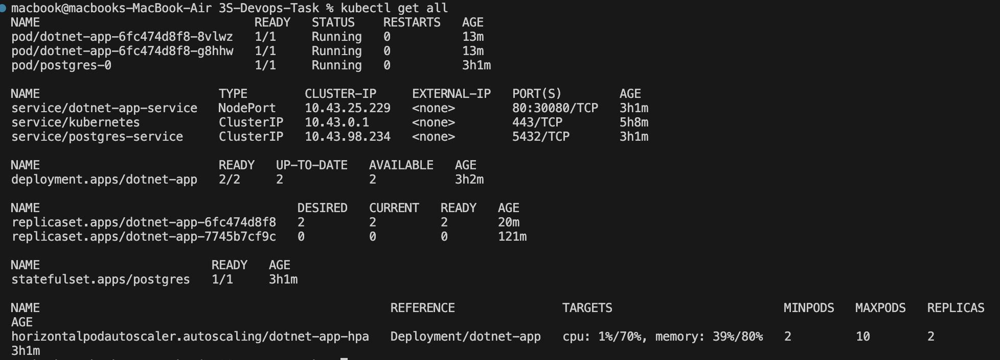

# DevOps Task: .NET Web API with Jenkins CI/CD on K3s

## Project Overview

This project showcases a complete DevOps workflow for a modern .NET 9 Web API application. The setup includes:

* Dockerizing the application using a multi-stage Dockerfile.
* Deploying to a lightweight Kubernetes cluster (K3s) running on two virtual machines (one master and one agent).
* Automating the build and deployment process using Jenkins pipeline.
* Note: Due to macOS network limitations, NodePort access was not functional, so `kubectl port-forward` was used to access the application.

## 📌Dockerfile Breakdown

The Dockerfile uses a **multi-stage build** for efficiency and clean final images. It consists of three stages:

### Stage 1: Build

* **Base Image**: Uses the official .NET SDK 9.0 image.
* **Working Directory**: Sets `/src` as the working directory.
* **Copying Files**: Copies the solution file and the complete source directory.
* **Restoring Dependencies**: Runs `dotnet restore` for the main project.
* **Building Project**: Compiles the project using `dotnet build` in Release mode.

### Stage 2: Publish

* Publishes the application to `/app/publish` without rebuilding or restoring again.
* Publishes in standard mode (not single file or ready-to-run) with compression enabled.

### Stage 3: Runtime

* **Base Image**: Uses the official .NET 9.0 ASP.NET runtime image.
* **Security**: Creates a non-root user (`appuser`) for better security.
* **File Copy**: Copies published app files from the previous stage.
* **Permissions**: Changes ownership of `/app` to the non-root user.
* **User Context**: Switches the user to `appuser`.
* **Port**: Exposes port 8080.
* **Start Command**: Runs the application using `dotnet`.


## 📌Kubernetes Manifests

All Kubernetes YAML files are organized in the `kubernetes-manifests/` directory under two folders:

* `app/`: Contains the manifests for the .NET Web API.
* `postgres/`: Contains the PostgreSQL StatefulSet and its resources.

### Resources Used

* `ConfigMap`: For environment variables like DB host, port, and name.
* `Secrets`: For storing sensitive data like DB username and password.
* `Deployment`: Deploys the API with 2 replicas and environment variables injected.
* `Service`: Exposes the API using `NodePort` (used `port-forward` instead).
* `PVC` and `PV`: Used for PostgreSQL data persistence.
* `StatefulSet`: Ensures stable identity and storage for PostgreSQL.



## 📌Jenkins Pipeline

A declarative Jenkinsfile is included to automate:

* Cloning the repo.
* Building and tagging the Docker image.
* Pushing it to Docker Hub.
* Updating the Kubernetes deployment with the new tag.


## K3s Setup

* Two virtual machines were created using Multipass.
* One was set as the K3s master node.
* The other joined as a K3s agent.
* `kubectl` was configured locally to access the K3s cluster.


## Application Access
### 1- https://localhost:7000/swagger/index.html


2- Due to NodePort not working on macOS (Multipass networking limitation), the app was accessed using:

  ```bash
  kubectl port-forward svc/dotnet-app-service 8080:80
  ```


## Notes

* Swagger requires authentication. A token was obtained via the `/api/token` endpoint.


* All environment variables used by the application are set through Kubernetes `ConfigMap` and `Secret`.

